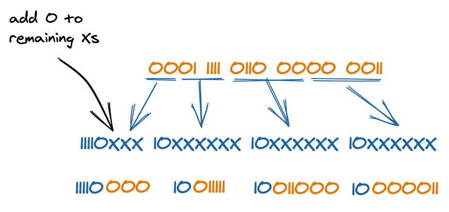

# Character Encodings

Solutions to exercises I included in my [blog post](https://dev.to/ravimashru/an-introduction-to-character-encodings-4od4).

## Exercise 1
**Decode the following hexadecimal ASCII encoded text: _48 65 6C 6C 6F 20 77 6F 72 6C 64 21_**

To decode ASCII, we can use an [ASCII table](http://www.asciitable.com) to find the corresponding character value of each byte shown as a hexadecimal number.

*Note: when using the table linked above, be sure to use the **Hx** column which contains hexadecimal values, and NOT **Dec** which contains decimal values.*

For example, from the table we see that 48 (in hexadecimal) has a character value of "H".

By decoding all other characters this way, we see the encoded text is **Hello world!**

## Exercise 2
**Encode the following text using ASCII (in hexadecimal): _That's All Folks!_**

Using an [ASCII table](http://www.asciitable.com) again, we see "T" can be encoded as 54 (in hexadecimal), "h" as 68, and so on.

Doing this for every character gives us the following encoding:

54 68 61 74 27 73 20 41 6C 6C 20 46 6F 6C 6B 73 21

## Exercise 3
**Encode the following text from exercise 2 using UTF-8 (in hexadecimal): _That's All Folks!_**

Since all the characters in the text are part of the ASCII character set, they will have the same encoding in UTF-8. All valid ASCII is also valid UTF-8.

The encoding in UTF-8 will therefore be the same as that in exercise 2:

54 68 61 74 27 73 20 41 6C 6C 20 46 6F 6C 6B 73 21

## Exercise 4
**Encode the following emoji using UTF-8: 😃**

We first need to find the code point value of this emoji. [This page](https://unicode-table.com/en/1F603/) shows that the emoji has a **Unicode number** of U+1F603. This just means that the emoji has a code point value of 1F603 (in hexadecimal).

Since this value falls in the range 10000 - 1FFFFF, we need 4 bytes to encode this value. These bytes will have the following format: `11110XXX 10XXXXXX 10XXXXXX 10XXXXXX`, where the `X`s will be substituted with the bits in the binary representation of 1F603 (the code point value of the emoji).

Converting 1F603 to binary, we get: `0001 1111 0110 0000 0011`. We can start filling in these bits in the place of `X`s, starting from the right-most bit:

This is the UTF-8 encoding of the emoji in binary. Converting this sequence to hexadecimal, we get the UTF-8 encoding of the emoji in hexadecimal: **F0 9F 98 83**.

## Exercise 5
**Decode the following bytes that have been encoded using UTF-8: _74 61 64 61 20 F0 9F 8E 89_**

We first convert the bytes to binary so that it is easy to see which bytes belong too a multi-byte encoding:

0111 0100 | 0110 0001 | 0110 0100 | 0110 0001 | 0010 0000 | 1111 0000 1001 1111 1000 1110 1000 1001

The first 5 bytes start with 0 and therefore are single-byte encodings of characters from the ASCII character set.

- 74 => t
- 61 => a
- 64 => d
- 61 =>a
- 20 => (space)

The 6th byte starts with four 1s. Therefore, the last four bytes are a multi-byte encoding of a single character. We need to extract the highlighted data bits in this sequence to get the code point value of the encoded character: 11110**000** 10**011111** 10**001110** 10**001001**.

The code point value in binary is: 000 011111 001110 001001. Converting this to hexadecimal we get: 1F389. From [here](https://unicode-table.com/en/1F389/) we know this is the code point of the emoji 🎉.

Therefore, the encoded bytes are for the text: **tada 🎉** (with a space between "tada" and the emoji).

